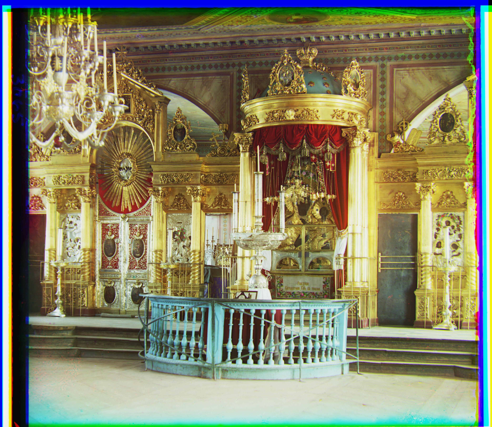
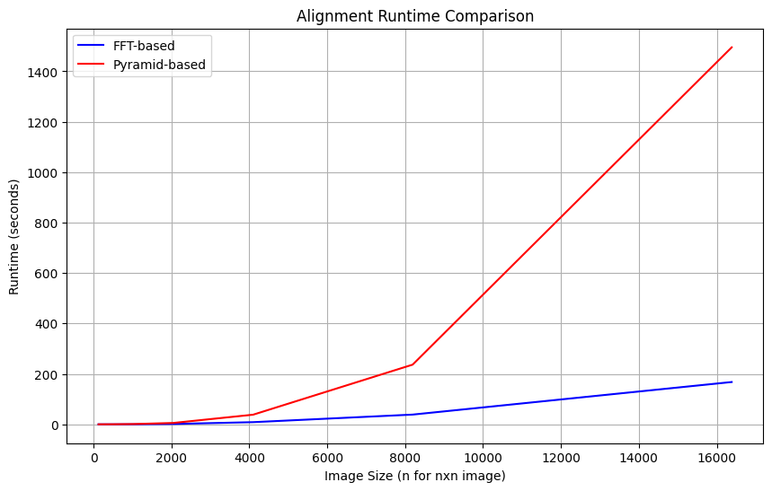
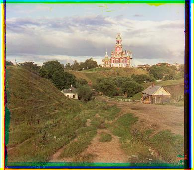
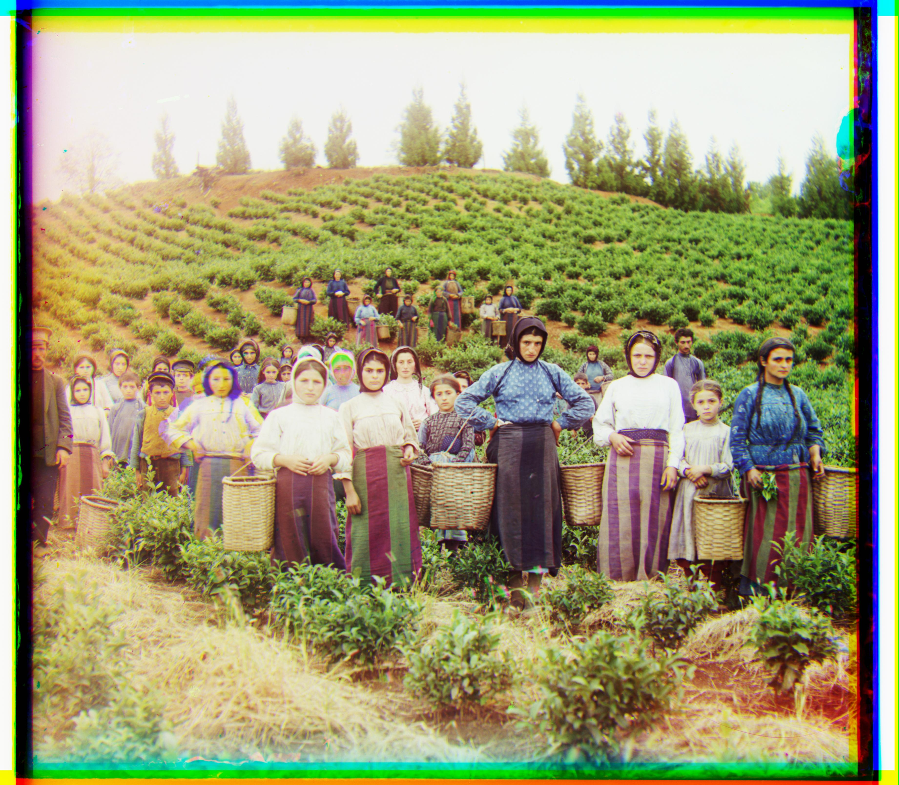
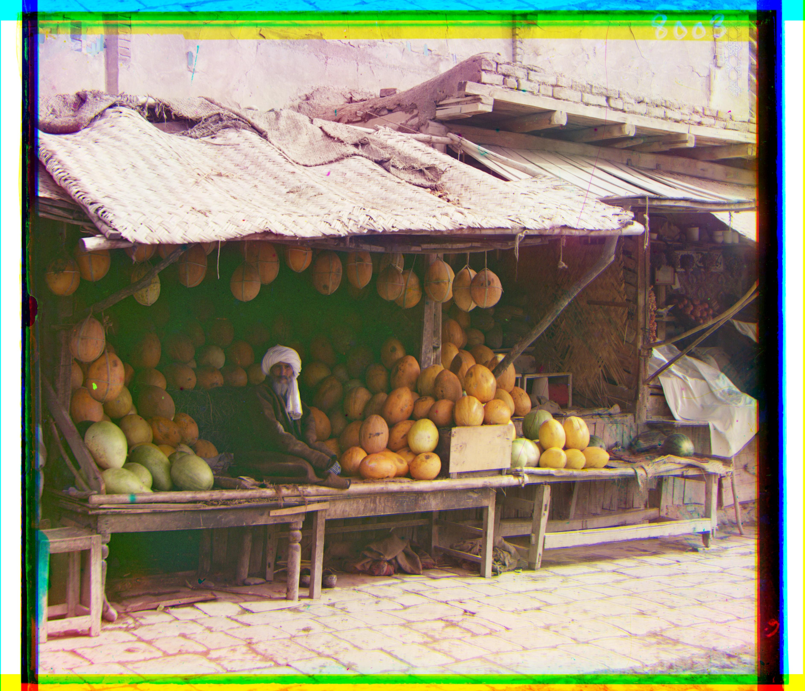
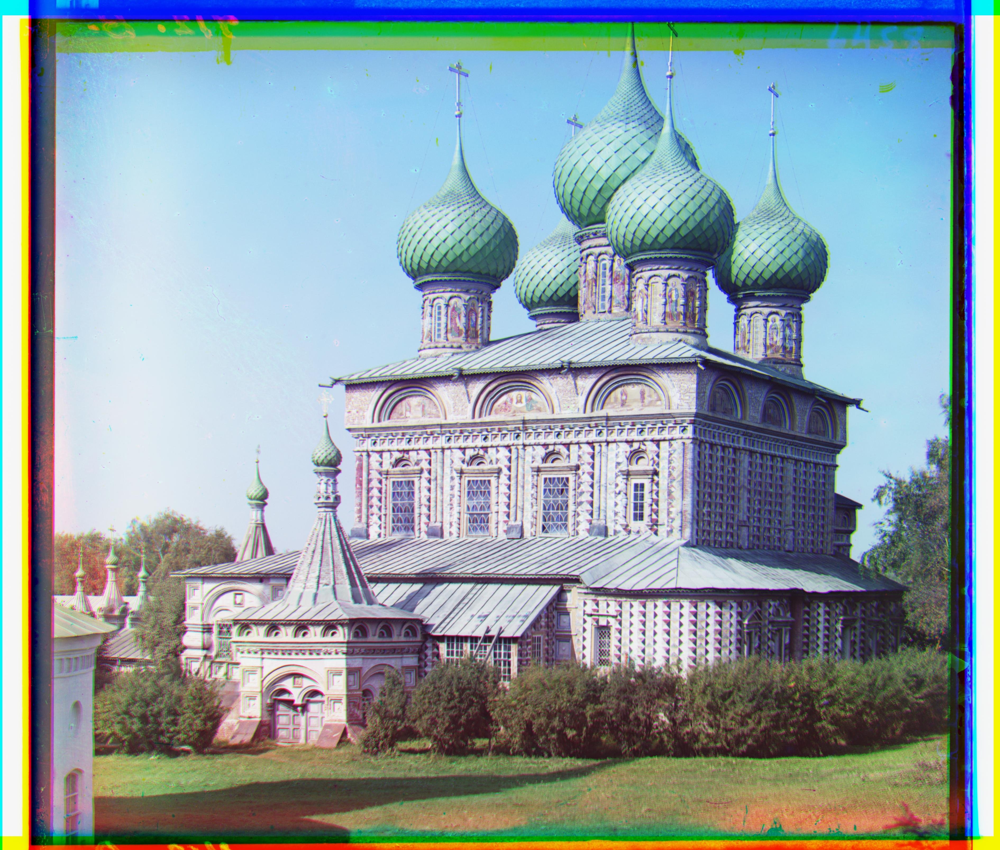
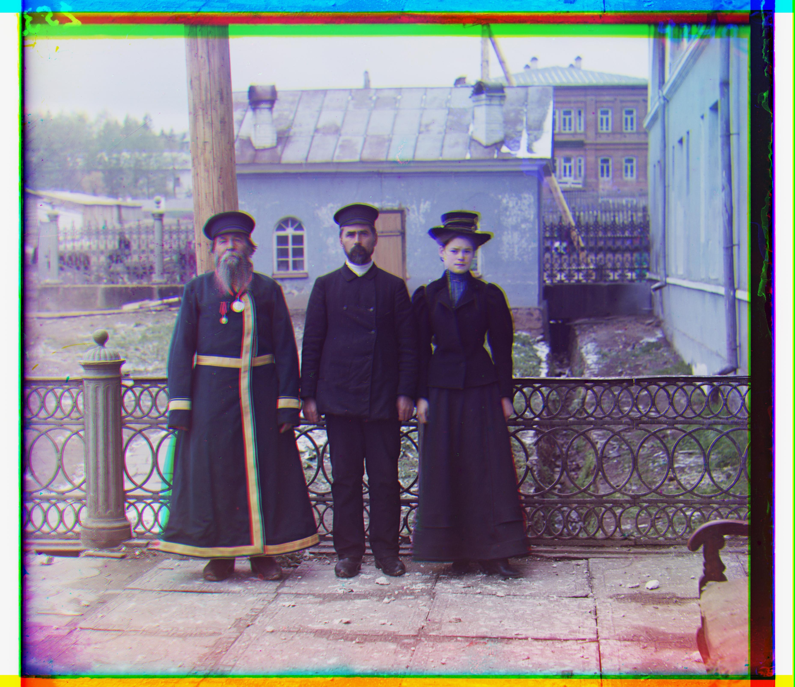

----
# Introduction

The Prokudin-Gorskii collection, led by Russian photographer Sergei Mikhailovich Prokudin-Gorskii in the early 20th century, is a pioneering project documenting the Russian Empire in color. Using an innovative method commissioned by Tsar Nicholas II, Prokudin-Gorskii captured three black-and-white images of the same scene through red, green, and blue filters. When combined, these images produced vivid color photographs, offering a rare glimpse into life over a century ago. Now preserved by the Library of Congress, the collection includes 1,902 digitized triple-frame glass negatives.

Prokudin-Gorskii believed in the future of color photography, and his method involved creating triple-frame negatives for vibrant projections. The task today is to align these three color channels—red, green, and blue—accurately, recreating sharp and true-to-original color images. Proper alignment avoids blurring and ensures the photographs reflect Prokudin-Gorskii's vision.

  
  ⟶
  
  ⟶
  

-----
# Methology

The general approach to align the color channels will be firstly find a base channel (eg: the blue channel) and align the other two channels to it. Then, we stack all channels together in the order of **r, g, b** to create a colored image. Thus, the tricky part is how to align two images effectively and efficiently.

## Alignment Metrics
To quantify how well two images align, we need a metric fucntion in the following form:
$$
\mathrm{metric}(\text{image A}, \text{image B}) = \text{score of alignment}
$$
One easy-to-think-of way is to use the $l_2$ distance of the brightness pixel map between the two images:
$$
\mathrm{E_\text{SSD}}(A, B) = \sqrt{\sum_i \sum_j \left(A(i, j) - B(i,j)\right)^2}
$$
This method is convenient to implement and effectively gives a degree of similarity between two monochromatic images. However, it has some draw backs such as it treats every pixel equally, and the $l_2$ norm is sensitive to outliers, which can be problematic when the two film images have random dark spots (due to technology at that time) or irregular borders. 

We can adopt a more robost metric using formula $\mathrm{E_\text{SRD}}(A, B) = \sum_i \sum_j \rho\left(A(i, j) - B(i,j)\right)$ where $\rho(\cdot)$ is some robust norm function such as the $l_1$ norm. 

Another more interesting (and more effective in my implementation) method is to use the **Normalized Cross-correlation (NCC)** as the metric, with the formula:
$$
\mathrm{E_\text{NCC}}(A, B) = \frac{\sum_{i,j}(A(i,j) - \bar{A})\times(B(i,j) - \bar{B})}{||A - \bar{A}||_F\cdot||B - \bar{B}||_F} \quad\quad\quad \bar{A} = \frac{1}{N}\sum_{i,j}A(i,j)
$$
where $||\cdot||_F$ is the Frobinus norm of matrices, and the subtraction between $A$ and $\bar{A}$ is element-wise.

The NCC metric effectively measures the correlation between the images (in pixel brightness) and gives a degree of how similar two images are. However, both the $SSD$ and $NCC$ are applied to pixel brightness, which is technically a risky choice for alignment. Due to the filming conditions and the filters, the optimal alignment probbaly do not have the same pixel brightness across each channel, and there may be a worse alignment that achieves better score than the "human-judged" optimal alignment when using the metric on brightness.

To solve this issue, we must analyze the invariant features accorss all color channels that can be used for pattern matching. In my solution,  I decide to use edge of objects in the image to match, because when filming the same object, the edges are less likely to change during the short interval of filming. 

To apply edge detection on images, we convolve the original image with the sobel operator both horizontally and vertically. The sobel operator is define as
$$
\mathrm{Sobel_{X}} = \begin{bmatrix}
-1&0&1\\-2&0&2\\-1&0&1
\end{bmatrix}\quad \mathrm{Sobel_{Y}} = \begin{bmatrix}
-1&-2&-1\\0&0&0\\1&2&1
\end{bmatrix}
$$
where convolving with $\mathrm{Sobel_{X}}$ gives detection on vertical edges and $\mathrm{Sobel_{Y}}$ derects horizontal edges. Example results are:

  

and when combined, it gives the full edge map of the original image:

  

Using $\mathrm{NCC}$ on the edge map, we are able to achieve much more accurate alignment than simple pixel brightness.

## Naive Alignment
The naive alignment is to search every possible shift between two images. This method will in theory give the best alignment according to the selected metric. Given that the images we are trying to align should be generally aligned with slight displacement, it's also desirable to search best shift between a selected range `[-displacement, displacement]`. In my naive implementation, I chose the `displacement` to be 15, and that means we search within the grid $[-15, 15]^2$. Here are some example aligned low-resolution images:

## Pyramid Search (Hierarchical Motion Estimation)

However, for high resolution images, the pixel displacement can be much larger (pixels become "smaller") and it's very expensive to search all possible shifts even within a selected range. Therefore, we need more clever ways such as constructing a gaussian pyramid. 

In my approach, I first compute the pyramid layer to be $\left\lceil\log_2\left(\frac{\min(\text{H}, \text{W})}{\text{min edge pixels}}\right)\right\rceil$, where `min edge pixels` is the threshold that the edge of the smallest image in the pyramid should be larger than, eg. 25 pixles. 

Then, from the original image, we continuously downsample the image in the previous layer to half of its size, until we reach the final layer. 

To search for the best alignment, we move from top to the bottom using this approach:

1. Compute a full search on the lowest-resolution image to get an initial assumption of the position. This should be fast if the layer of the pyramid is high enough. In my implementation, by choosing `min edge pixels=25`, I get a pyramid of layer 7 and the final resolution can be as low as $45\times 52$.

2. For the rest images in the pyramid, we start our search from the best alignment in the last layer. Because the resolition of the next image is doubled, if the best shift from last layer is `(x, y)`, then this layer will search starting from `(2x, 2y)`.

3. For layers larger than 1, we only search within the range $[-1, 1]$ a  round the starting point. If the best displacement from the start point is `(a,b)`, then pass the location `(2x + a, 2y + b)` to the next layer.

This pyramid approach is much faster than the naive search even for low resolution images. Here are some aligned example photos using this approach.

----
# Fancy Stuff

## Fourier-Based Fast NCC Computation

The fourier transform approach is based on the fact that convolution in the spatial domain corresponds to multiplication in the Fourier domain, namely:
$$
\mathcal{F}(E_\text{NCC}) = \mathcal{F}(A_N)\bar{*}\mathcal{F}(B_N) \implies E_\text{NCC} = \mathcal{F}^{-1}(\big|\mathcal{F}(A_N)\bar{*}\mathcal{F}(B_N)\big|) \quad A_N = \frac{A - \bar{A}}{||A - \bar{A}||_F}
$$
Suppose all images have the same dimension $m\times n$, let's do a runtime analysis on the `naive approach`, the `pyramid approach`, and the `FFT approach`:

 

1. To search for the optimal shift using the naive approach, we need to search every possible combination in the $x$-$y$ directions, and that's $\mathcal{O}(mn)$ combinations. Even if we only search a selected range, as the image size grows, this range should also scale proportionally. And at each possible shift, we evaluate the metric which involves all pixels, and that's at least $\mathcal{O}(mn)$. Therefore, the runtime of the naive approach is $\mathcal{O}(m^2n^2)$. 

 

2. In the pyramid approach, we always downsample the original image to the lowest resolution above some threshold (layer 1). Therefore, the exhaust search at this level is a constant. For the rest layers, we only search in a $3\times 3$ grid, and each evaluation takes $\mathcal{O}(\frac{mn}{4^i})$ time. Therefore, the total runtime is
$$
T(m, n) = \underbrace{\mathcal{O}(mn) + \mathcal{O}\left(\frac{mn}{4}\right) + \mathcal{O}\left(\frac{mn}{4^2}\right) + \cdots + \mathcal{O}(1)}_{\log_2{\min{(m,n)}} \text{ terms}} = \mathcal{O}(mn) + C
$$
where $C$ is the exhaustive search constant. 

 

3. In the fourier-based approach, using the fast fourier transform, we can compute the fourier transform of the images in $\mathcal{O}(mn\log(mn))$. The conjugate multiplication takes $\mathcal{O}(mn)$, and the inverse fourier transform takes $\mathcal{O}(mn\log(mn))$. Therefore, we can get the NCC map of every possible shift in $\mathcal{O}(mn\log(mn))$, and finding the argmax is $\mathcal{O}(mn)$. Finally, the $\mathcal{O}(mn\log(mn))$ term dominates. 

Even though asymptotically, the pyramid approach is better than the fourier approach, but in practice, the pyramid approach has a huge overhead and behaves worse than the FFT. Here's a graph showing the relationship between runtime and input size:

  
  

Fitted Runtime: \( \text{Pyramid: } \mathcal{O}(n^{2.11}) \quad \text{FFT: } \mathcal{O}(n^{2.24})\)
(48, 5)

Here's also a table summarizing the runtime and best shift:

| FFT Out Image | FFT Runtime | FFT Best Shift | Pyramid Runtime | Pyramid Best Shift |
|---------------|-------------|----------------|-----------------|--------------------|
|  | 0.02s | B(-5, -2) R(7, 1) | 0.31s | B(-5, -2) R(7, 1) |
|  | 2.9s | B(-25, -4) R(33, -8) | 16.39s | B(-25, -4) R(33, -8) |
|  | 2.9s | B(-49, -23) R(57, 17) | 16.59s | B(-49, -23) R(58, 17) |
|  | 3.89s | B(-60, -18) R(65, -3) | 16.2s | B(-60, -17) R(64, -3) |
|  | 3.08s | B(-38, -16) R(48, 5) | 16.62s | B(-41, -17) R(48, 5) |
|  | 2.6s | B(-56, -10) R(63, 3) | 16.63s | B(-56, -9) R(63, 3) |
|  | 2.53s | B(-79, -9) R(96, 4) | 16.76s | B(-80, -10) R(96, 3) |
|  | 0.023s | B(3, -2) R(6, 1) | 0.29s | B(3, -2) R(6, 1) |
|  | 3.27s | B(-52, -24) R(58, 9) | 16.95s | B(-52, -24) R(57, 10) |
|  | 3.2s | B(-33, 11) R(107, -16) | 16.8s | B(-33, 11) R(106, -16) |
|  | 3s | B(-77, -29) R(98, 8) | 17.35s | B(-78, -29) R(98, 8) |
|  | 2.9s | B(-56, -12) R(59, -6) | 16.4s | B(-54, -12) R(58, 1) |
|  | 0.025s | B(-3, -3) R(4, 0) | 0.29s | B(-3, -3) R(4, 1) |
|  | 2.8s | B(-40, -8) R(41, 27) | 16.8s | B(-41, -2) R(44, 27) |

